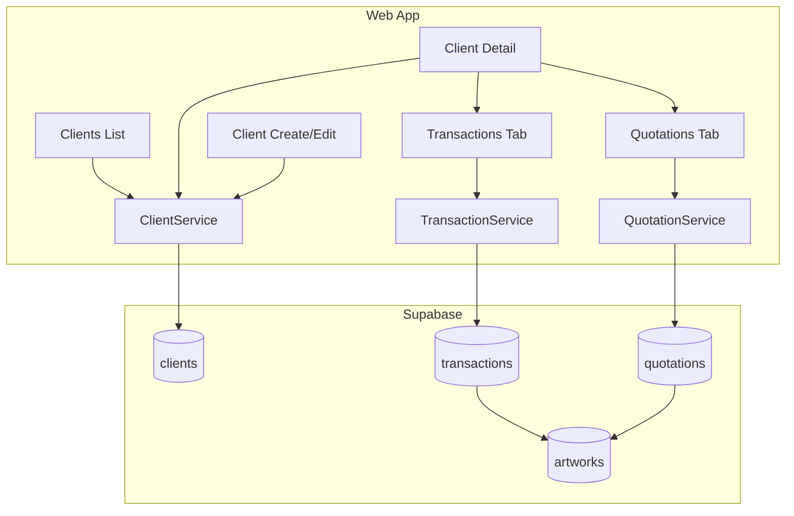
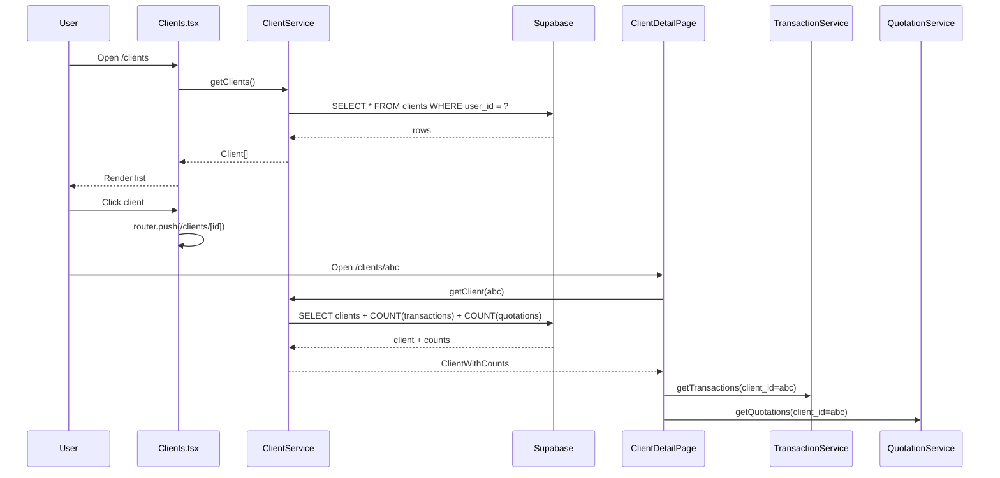

# Artists CRM - Detailed Plan

## Objective

Build a CRM for artists (and gallery users) to manage their clientèle: clients, sales, quotations, and client–art relationships. The CRM provides list/detail/create/edit views for clients, surfaces transactions and quotations per client, and integrates with the existing import flow.

---

## Implementation Status

| Phase | Status | Notes |
|-------|--------|-------|
| Phase 1: Clients Module | Done | ClientService, list, detail, form, nav |
| Phase 2: Transactions & Quotations | Done | TransactionService, QuotationService, forms, Client detail tabs |
| Phase 3: CRM Dashboard & Enhancements | Pending | Optional overview, import integration, address field |

---

## Current State Summary

| Area | Status | Location |
|------|--------|----------|
| **Clients** | Table exists, RLS, UI implemented | `clients` (user_id, name, email, phone, company, type, notes) |
| **Transactions** | Table exists, links to clients/artworks | `transactions` (sale, purchase, commission, etc.) |
| **Quotations** | Table exists, links to clients/artworks | `quotations` (draft, sent, accepted, etc.) |
| **Import** | Extracts clients from docs, saves to `clients` | `apps/web-app/src/features/import/` |
| **Artists page** | Placeholder with dummy data | `apps/web-app/src/features/management/ArtistsPage.tsx` |

Artists = users with `user_type: 'artist'` (and galleries). The CRM is user-scoped via `user_id`; no separate artists table.

---

## Architecture Overview



---

## Phase 1: Clients Module (MVP)

### 1.1 ClientService

**File:** `apps/web-app/src/services/client-service.ts`

- `getClients(filters?)` - list all clients for current user, optional search/filter by type
- `getClient(id)` - single client with counts (transactions, quotations)
- `createClient(data)` - insert
- `updateClient(id, data)` - update
- `deleteClient(id)` - delete

### 1.2 Clients List Page

**Route:** `app/(Main)/clients/page.tsx`

**Feature:** `src/features/clients/Clients.tsx`

- Header: "Clients", subtitle, "Add Client" button
- Search by name, email, company
- Filter by `type` (collector, buyer, gallery, dealer, institution, other)
- Grid of client cards: name, email, company, type, created date
- Empty state, loading skeleton, error state
- Click card → `/clients/[id]`

### 1.3 Client Detail Page

**Route:** `app/(Main)/clients/[id]/page.tsx`

**Feature:** `src/features/clients/ClientDetailPage.tsx`

- Fetch client by ID (ClientService.getClient)
- Header: client name, Edit, Delete
- Info: email, phone, company, type, notes
- Tabs: Overview, Transactions, Quotations
- Overview: transaction count, quotation count, total sales value
- Transactions: list with artwork, amount, date, type
- Quotations: list with artwork, amount, status, valid_until
- "Add Transaction" / "Add Quotation" buttons

### 1.4 Client Create/Edit Form

**Component:** `src/features/clients/ClientForm.tsx`

- Fields: name (required), email, phone, company, type (select), notes
- Used in Dialog for create and edit
- Validate, call ClientService.createClient / updateClient

### 1.5 Navigation

**File:** `apps/web-app/src/components/app-sidebar.tsx`

- "Clients" nav item with Users icon in `mainNavItems`

---

## Phase 2: Transactions and Quotations Management

### 2.1 TransactionService

**File:** `apps/web-app/src/services/transaction-service.ts`

- `getTransactions(filters?)` - by user_id, optional client_id, artwork_id
- `getTransaction(id)`
- `createTransaction(data)`
- `updateTransaction(id, data)`
- `deleteTransaction(id)`

### 2.2 QuotationService

**File:** `apps/web-app/src/services/quotation-service.ts`

- `getQuotations(filters?)` - by user_id, optional client_id, artwork_id, status
- `getQuotation(id)`
- `createQuotation(data)`
- `updateQuotation(id, data)`
- `deleteQuotation(id)`

### 2.3 Transaction Form

**Component:** `src/features/clients/TransactionForm.tsx`

- Client (pre-filled), Artwork (select from user's artworks), type, amount, currency, date, invoice_number, notes
- Create (dialog)

### 2.4 Quotation Form

**Component:** `src/features/clients/QuotationForm.tsx`

- Client (pre-filled), Artwork, amount, currency, valid_until, status, quotation_number, notes
- Create (dialog)

### 2.5 Integration in Client Detail

- "Add Transaction" opens TransactionForm with client pre-filled
- "Add Quotation" opens QuotationForm with client pre-filled
- List transactions/quotations with artwork names via join

---

## Phase 3: CRM Dashboard and Enhancements (Optional)

### 3.1 CRM Overview

- Widget or page: total clients, recent transactions, quotations by status
- Could extend Dashboard or add `/crm` route

### 3.2 Import Integration

- After import saves clients, prompt: "X new clients added. View clients?"
- Link from Import History to Clients list

### 3.3 Schema Extension

- Add `address` to `clients` if needed
- Migration: `ALTER TABLE clients ADD COLUMN address TEXT;`
- Update ClientForm, ClientCard in import, save API

---

## File Structure

```
apps/web-app/
├── app/(Main)/
│   └── clients/
│       ├── page.tsx
│       └── [id]/
│           └── page.tsx
├── src/
│   ├── features/
│   │   └── clients/
│   │       ├── Clients.tsx
│   │       ├── ClientDetailPage.tsx
│   │       ├── ClientForm.tsx
│   │       ├── TransactionForm.tsx
│   │       └── QuotationForm.tsx
│   └── services/
│       ├── client-service.ts
│       ├── transaction-service.ts
│       └── quotation-service.ts
```

---

## Data Flow



---

## Design System and Patterns

- Use `@aetherlabs/ui` components (Button, Card, Dialog, Input, Select, Badge, etc.)
- Theme tokens: `bg-primary`, `text-foreground`, `border-border`, `text-muted-foreground`, etc.
- Follow Artworks list layout (stats, search, filter, grid)
- Follow ArtworkDetailPage for detail layout (header, back, sections/tabs)
- Skeletons: `ClientGridSkeleton`, `ClientCardSkeleton`
- Empty states: `EmptyClients`, `EmptyClientSearchResults`

---

## Migration Considerations

- No schema changes required for Phase 1 or Phase 2; existing tables are sufficient
- Phase 3 may add `address` column to `clients`
